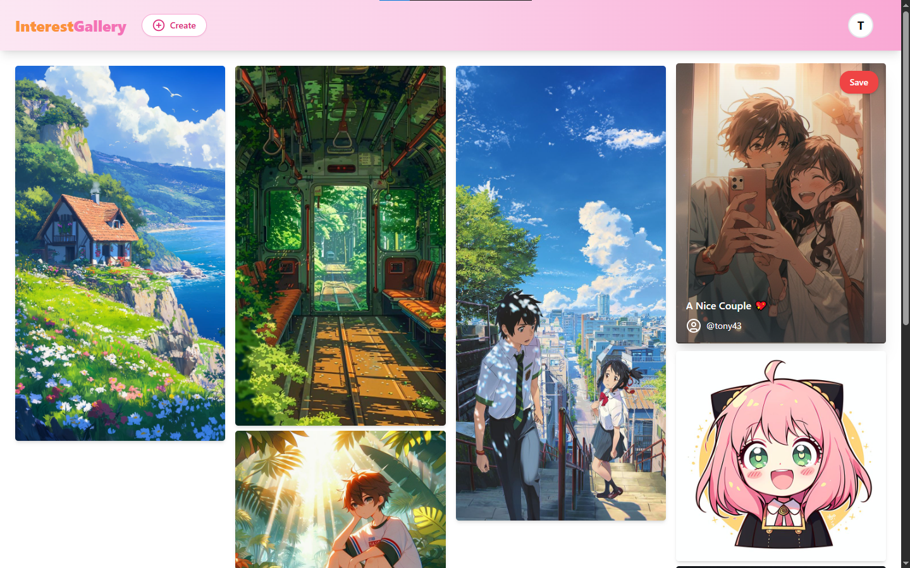

# 🖼️ Interest Gallery

> A visually-rich platform where users can post, explore, save, and share stunning images, wallpapers, and photos — all in one place.

---

## 📸 Live Demo

🌐 [Visit Interest Gallery](https://interestgallery.vercel.app)  



---

## 🌟 Features

- 📤 Upload beautiful images and wallpapers
- 💾 Save your favorite images to revisit anytime
- 💬 Comment on posts and engage with others
- 🔗 Share images with friends and communities
- 🔒 Authentication using NextAuth (Google/GitHub login)
- 🎨 Clean and responsive UI with Tailwind CSS

---

## 💻 Tech Stack

**Frontend:** Next.js, Tailwind CSS  
**Backend:** Next.js API Routes, Prisma (PostgreSQL)  
**Auth:** NextAuth.js  
**ORM:** Prisma  
**Database:** PostgreSQL

---

## 🛠️ Installation

```bash
# Clone the repo
git clone https://github.com/yourusername/interest-gallery.git

# Navigate into the directory
cd interest-gallery

# Install dependencies
npm install

# Add your environment variables in a .env file
cp .env.example .env

# Push Prisma schema to your database
npx prisma db push

# Run the development server
npm run dev
